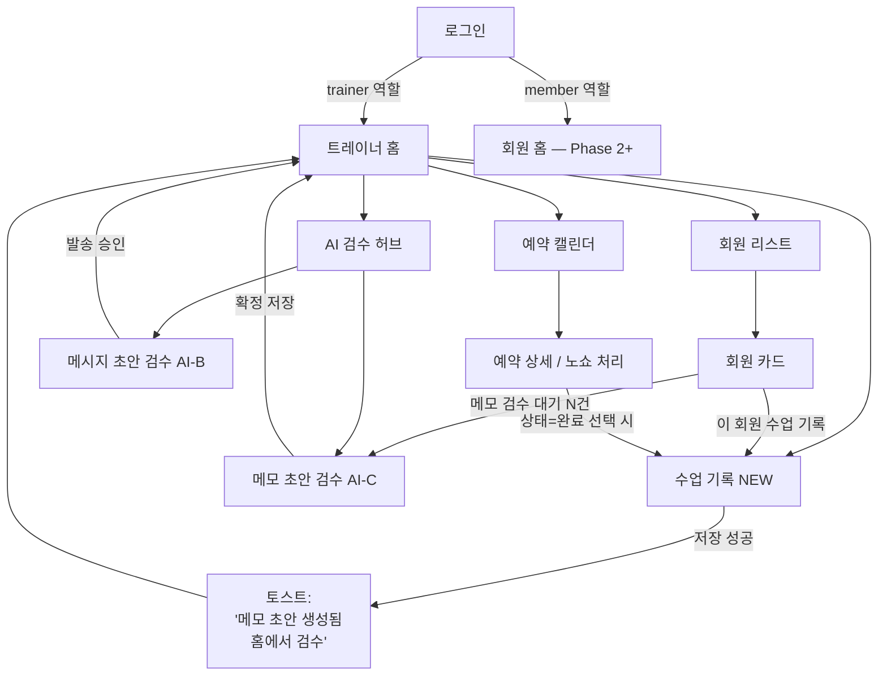

# Gyman — 와이어프레임 (v0.1 초안)

> 본 폴더는 `docs/develop_plan.md` §3 라우트 맵과 §4 Phase 1 작업에 대응하는
> **트레이너 앱 화면 와이어프레임**을 담습니다.
>
> 작성일: 2026-05-24
> 상태: **초안 1차** — 친구 리뷰 후 수정 반영 → 확정되면 Figma로 이행
> 표기: ASCII (Git 버전관리 + 빠른 채팅 피드백 목적)

---

## 1. 파일 구성

| 파일 | 내용 | 대응 작업 |
|------|------|----------|
| `README.md` (본 문서) | 인덱스, 화면 흐름도, 표기 규칙 | - |
| `01_auth.md` | 로그인 + 역할 분기 | Phase 1 / 1.1 |
| `02_trainer_home.md` | 트레이너 홈 (오늘 수업·재등록·AI 검수 대기) | Phase 1 / 1.7, 1.8, 1.9, 1.10 |
| `03_session_log.md` | 수업 기록 NEW (**핵심 KPI: 1분 입력**) | Phase 1 / 1.4, 1.5 |
| `04_member_card.md` | 회원 카드 + 트레이너 전용 메모 영역 | Phase 1 / 1.2, 1.10 |
| `05_booking.md` | 예약 캘린더 + 노쇼/취소 처리 | Phase 1 / 1.6 |
| `06_ai_review.md` | AI 검수 허브 + 메시지 초안 검수 + 메모 초안 검수 | Phase 1 / 1.9, 1.10 |

> 의도적으로 1차 초안은 **트레이너 앱만** 만듭니다. 회원 앱은 Phase 2~3에서 분리.

---

## 2. 화면 전이 흐름도

> 핵심 흐름 — **"수업 끝 → 1분 기록 저장 → 홈으로 복귀 → 시간 날 때 AI 검수 배치 처리"**.
> 수업 기록 후 AI 검수 화면으로 강제 이동하지 않는 이유: 1분 입력 KPI 보호 + 트레이너가 검수에 충분한 집중력을 확보한 시점에 한꺼번에 처리하도록.

---

## 3. 공통 표기 규칙

### 3.1 ASCII 요소

| 표기 | 의미 |
|------|------|
| `[버튼]` | 탭 가능한 버튼 |
| `(●)` / `( )` | 라디오 선택됨 / 비선택 |
| `[v]` / `[ ]` | 체크박스 선택됨 / 비선택 |
| `[입력_____]` | 텍스트 입력 필드 |
| `▼` | 드롭다운 |
| `←` `→` | 네비게이션 (뒤로/앞으로) |
| `⋮` | 더보기 메뉴 |
| `☰` | 햄버거 메뉴 (전체 메뉴 트레이) |

### 3.2 아이콘 / 색상 신호

| 표기 | 의미 |
|------|------|
| 🔒 | **트레이너 전용** (회원 노출 X — RLS로 차단됨) |
| 🤖 / `ⓘ AI 생성` | AI가 만든 콘텐츠 (검수 전·후 모두 표기) |
| ⚠ | 주의 (예: 잔여 5회 이하, 만료 임박) |
| ⚠⚠ | 위급 (예: 만료 D-3 이내) |
| ✅ ⏰ ❌ | 수업 상태: 완료 / 예정 / 취소·노쇼 |
| 🟢 🟡 🔴 ⚪ | 회원 상태 신호등 (정상/주의/위급/장기 비활성) |

### 3.3 화면 폭

- 모든 와이어프레임은 **52자 폭** (`│ ... │` 양 끝 포함)
- 모바일 세로 화면 1개 = ASCII 약 30~45줄 분량
- 가로 스크롤 가정하지 않음 (필요시 명시)

### 3.4 라우트 표기

각 화면 상단에 `develop_plan §3.1`의 라우트 경로를 명시합니다.
예: `/trainer/session/new`

---

## 4. 디자인 의사결정 메모 (1차 초안에서 굳힌 것)

| # | 결정 | 근거 |
|---|------|------|
| 1 | 하단 탭바 5개 (홈/회원/기록+/예약/채팅) | 트레이너 핵심 동선 5개. 채팅은 Phase 2 활성화 |
| 2 | 가운데 탭(`📝+`) = 수업 기록 즉시 진입 | 1분 입력 KPI를 위한 최단 동선 — "수업 끝나자마자 화면 가운데 탭" |
| 3 | 수업 기록 저장 후 자동 화면 전환 X | AI 검수 화면 자동 이동 시 입력 흐름 깨짐. 토스트만 띄우고 홈 복귀 |
| 4 | AI 검수는 "검수 대기 N건" 카드로 표시 | 강요 X, 트레이너 페이스에 맞춰 배치 처리 가능 |
| 5 | 트레이너 전용 메모 영역은 회원 카드 안에 인라인 표시 | 별도 페이지로 분리 시 트레이너가 안 보게 됨. 단, 시각적으로 🔒 강조 |
| 6 | AI 생성 콘텐츠는 검수 후에도 `ⓘ AI 생성` 작은 라벨 유지 | 사후 분쟁/추적용 audit 일관성 |
| 7 | "재등록 임박" 카드는 홈 상단에 고정 | 매출 직결, 잊지 않도록 |

---

## 5. 미정 / 친구 리뷰 요청 사항

> 친구가 1차 와이어프레임 보고 답해주면 좋은 질문들.

1. **수업 기록 화면의 입력 순서**: 운동 → 컨디션 → 다음메모 순서가 자연스러운지, 아니면 회원 컨디션부터 먼저 묻는 게 맞는지?
2. **종목 즐겨찾기**: 트레이너별 즐겨찾기 vs 회원별 자주 쓰는 종목 자동 추출, 어느 쪽이 더 유용한지?
3. **노쇼 차감 규정 UI**: 라디오 버튼으로 충분한지, 센터 규정을 화면에 항상 표시해야 하는지?
4. **AI 메모 초안 톤**: 격식 있는 문체 vs 트레이너의 평소 메모 톤(축약·구어체)? 초기 prompt 설계에 반영.
5. **AI 안내 메시지 시점**: 수업 전날 저녁 8시 발송이 적당한지? 시간대 설정 필요한가?
6. **하단 탭바 가운데에 수업 기록(📝+) 두는 게 맞는지**, 아니면 별도 FAB(떠 있는 버튼)이 나은지?

---

## 6. 다음 단계

- [ ] 1차 초안 친구 공유 → 위 §5 질문 답변 수집
- [ ] 피드백 반영하여 v0.2 작성
- [ ] 확정되면 Figma로 이행 (선택)
- [ ] Phase 0 종료 조건의 "와이어프레임 친구 1차 리뷰 완료" 체크
